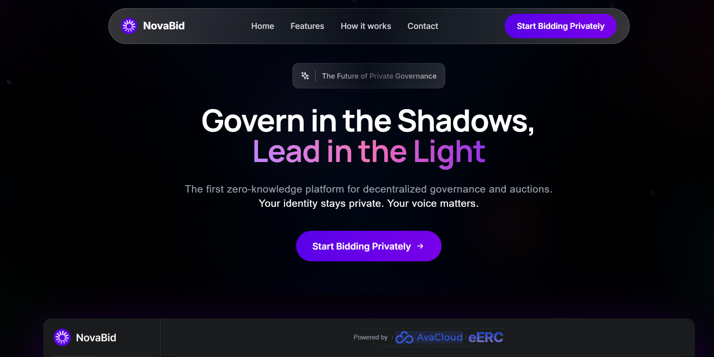
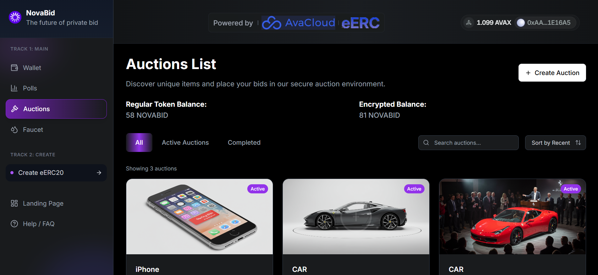

---

````markdown
# **NovaBid Monorepo**

## **Demo**

- **Live Demo**: [https://novabid.app](https://novabid.app)
- **Video Presentation**: [https://www.conexionssee.com/novabid/presentation.mp4](https://www.conexionssee.com/novabid/presentation.mp4)

---

## **Frontend Screenshots**

### **User Interface Preview**





---

## **Introduction**

**NovaBid** is a decentralized privacy-first voting and auction platform built on the Avalanche network, using the **eERC20 standard** by AvaCloud.

It empowers users to:

- Launch and participate in **private voting rounds**.
- Create and manage **privacy-preserving auctions**.
- Earn and use eERC20 tokens in real use cases.

This monorepo contains:

- `novabid-frontend` (React + Vite)
- `novabid-cli-backend` (Javascript)
- `eercdeployer-backend` (tsc from Avalabs)

---

## **Prerequisites**

Make sure you have:

- **Node.js** (v18 or higher)
- **Git**
- **NPM** (optional but recommended)

---

## **Project Structure**

```plaintext
novabid/
├── novabid-frontend/
├── novabid-backend/
```

---

## **Frontend**

### **Features**

- Create and join voting sessions
- Participate in private auctions
- Vote anonymously using eERC20 tokens
- Faucet integration to mint test tokens
- Dynamic UI for tracking real-time voting results
- Mobile-first, responsive design

### **Installation and Usage**

```bash
git clone https://github.com/didierjey8/novabid
cd novabid/novabid-frontend
npm install
npm run dev
```

To build for production:

```bash
npm run build
```

### **Environment Variables**

Create a `.env` file with:

```env
VITE_API_URL=https://your-backend-url.com
```

---

## **Backend**

### **Features**

-For creating the token on the blockchain:

### **Installation and Usage**

```bash
npx hardhat compile
npx hardhat zkit make --force
npx hardhat zkit verifiers
```

To Deploy:

```bash
npx hardhat run scripts/deploy-standalone.ts --network localhost
# o
npx hardhat run scripts/deploy-converter.ts --network localhost
```

### **Environment Variables**

Add a `.env` file:

```env
PRIVATE_KEY
RPC_URL
PORT
```

---

## **Deployment**

### **Frontend**

Use **Cloudflare Pages**, **Vercel**, or **Netlify**. If using Vite, make sure the `base` path is correct in `vite.config.js`.

### **Backend**

Recommended on **Render**, **DigitalOcean App Platform**, or **AWS ECS**. Use managed PostgreSQL like Supabase or Neon.

---

## **Technologies Used**

- **React** with **Vite**
- **TailwindCSS** for styling
- **Express** for API
- **eERC20 + ethers.js** for blockchain logic
- **Cloudflare Pages** for frontend deployment
- **N8N** for Agent

---

## **License**

This project is licensed under the **MIT License**.

---

## **Contact**

For questions, open an issue or contact us at:
📧 [didierjey8@gmail.com](mailto:didierjey8@gmail.com)

```

```
